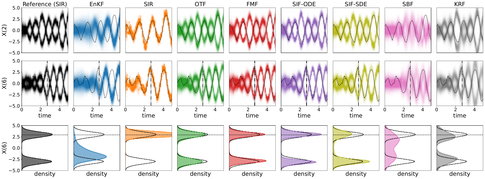
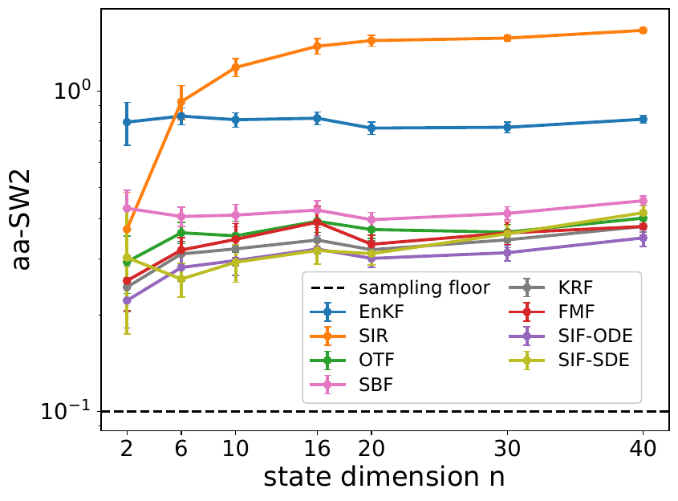
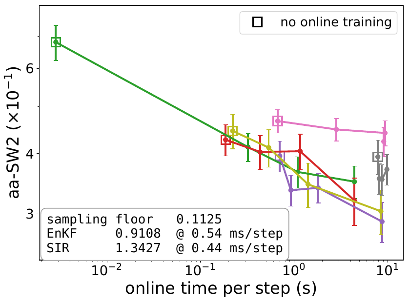
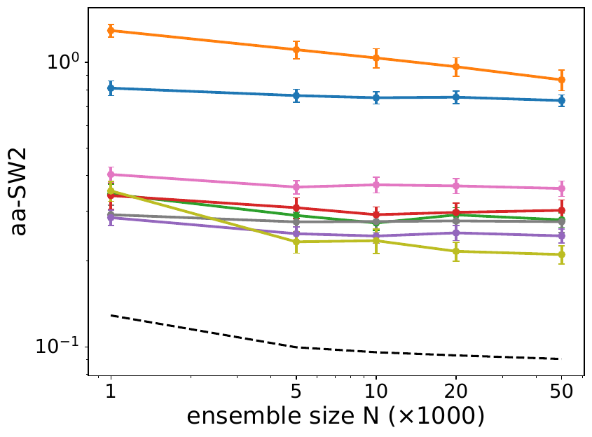
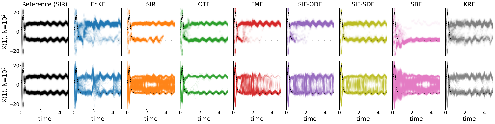
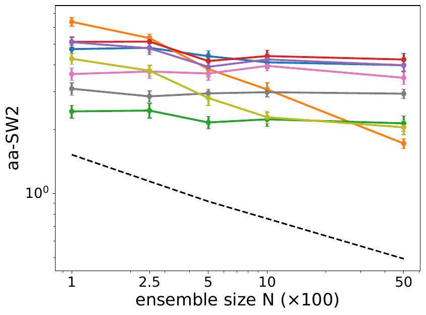

# Generative Models for Simulation-Based Filtering

Code accompanying

> **[Generative models for simulation based filtering: Formulations and Empirical Comparisons](https://arxiv.org/abs/2609.16317)**
> 
> [Mohammad Al-Jarrah](https://sites.google.com/view/mohammadaljarrah), [Wei Deng](https://www.weideng.org), [Bamdad Hosseini](https://bamdadhosseini.org/), [Amirhossein Taghvaei](https://amirtag.github.io)

The paper gives a unified formulation of generative-model approaches to nonlinear
filtering, in which the analysis (conditioning) step is realized by a **triangular
transport** of the forecast distribution to the posterior, and the methods differ
only in how that transport is selected and learned. Three filters are derived here
— from stochastic interpolants, their deterministic flow-matching limit, and
Schrödinger bridges — and compared against established alternatives under identical
ensembles, a common metric, and matched computational budgets.

---

## The filters

| Filter | Transport / coupling | Learning | Inference | File |
|---|---|---|---|---|
| **OTF** | optimal-transport map `T` | adversarial max–min | one-shot | `OTF.py` |
| **KRF** | Knothe–Rosenblatt map `S` | maximum likelihood | one-shot, bisection | `KRF.py` |
| **FMF** | deterministic interpolant | regression | ODE, Euler steps | `FMF.py` |
| **SIF-ODE** | stochastic interpolant (ε>0, λ=0) | regression | ODE | `SIF.py` |
| **SIF-SDE** | stochastic interpolant (ε>0, λ=1) | regression | SDE | `SIF.py` |
| **SBF** | forward/backward drifts | minimum energy (Schrödinger bridge) | reversed SDE | `SBF.py` |
| **EnKF** | — (Gaussian ansatz) | trains nothing | one-shot | `EnKF.py` |
| **SIR** | — (importance weights) | trains nothing | resampling | `SIR.py` |

`SIF.py` implements both SIF variants; which one runs is set by the
`(NOISE_LEVEL, DENOISER_WEIGHT, INFERENCE_MODE)` triple in its parameter dict.
EnKF and SIR are flat baselines: they train nothing, take no warm start, and have
no online budget.

**Accuracy metric.** All comparisons use the axis-aligned sliced Wasserstein-2
distance (aa-SW2) between the filter ensemble and a reference posterior, averaged
over the state coordinates and over the analysis steps. Every figure also reports a
**sampling floor** — the aa-SW2 between an *independent* draw of the same size from
the reference and the reference itself — which is the error induced purely by a
finite ensemble and which no algorithm is expected to beat.

---

## Repository layout

### Filter implementations

| File | Purpose |
|---|---|
| `EnKF.py` | Ensemble Kalman filter — baseline, trains nothing |
| `SIR.py` | Sequential importance resampling particle filter — baseline, also used to build the reference posteriors |
| `OTF.py` | Optimal transport filter — adversarial max–min training of a critic/map pair |
| `KRF.py` | Knothe–Rosenblatt rearrangement filter — monotone triangular map, inverted coordinate-wise by bisection |
| `FMF.py` | Flow matching filter — deterministic interpolant, ODE inference |
| `SIF.py` | Stochastic interpolant filter — both the ODE (λ=0) and SDE (λ=1) variants |
| `SBF.py` | Schrödinger bridge filter — forward–backward SDE, IPF-style alternating training |
| `timing_utils.py` | `sync_clock`, a CUDA-aware wall clock so per-analysis-step timings measure execution rather than kernel launch |

### Hyperparameters

| File | Purpose |
|---|---|
| `param_one_step.py` | **Stage-1 incumbents** — the cold spin-up configuration (architecture, learning rate, batch size, training budget) for every learned method |
| `param_multi_steps_fi.py` | **Stage-2 incumbents**, keyed by `(method, FI)` — the online-refinement configuration at each budget level. This is what the experiment scripts read |

### Tuning (stages 1 and 2)

| File | Purpose |
|---|---|
| `tuning_stage_one.py` | Stage-1 SMAC tuner: searches the cold spin-up hyperparameters at `T = 2`, one method at a time. Writes `logs/best_one_step_<method>_sim2.json` |
| `tuning_stage_two.py` | Stage-2 SMAC tuner: warm-starts from the stage-1 weights and searches only the online-refinement optimizer knobs, at one budget level per run. Writes `logs/best_multi_steps_<method>_fi<FI>_sim2.json` |

### Experiments

| File | Purpose |
|---|---|
| `Quadratic.py` | Full particle-trajectory run of the quadratic benchmark at one budget — the data source for the density figures |
| `Quadratic_vs_final_iter.py` | Error and cost vs **online budget** (`FI ∈ {0, 1, 4, 16}`) |
| `Quadratic_vs_dim.py` | Error and cost vs **state dimension** (`n ∈ {1, 3, 5, 8, 10, 15, 20}`, i.e. `L = 2n`) |
| `Quadratic_vs_particles.py` | Error and cost vs **ensemble size** (`N ∈ {1000, …, 50000}`) |
| `L63.py` | Lorenz-63 transfer test — the quadratic-tuned configurations applied unchanged, running both phases back to back |
| `L63_vs_particles.py` | Lorenz-63 error and cost vs **ensemble size** (`N ∈ {100, …, 5000}`) |
| `Quadratic_select_method.py` | Regenerates one method's stage-1 warm-start checkpoints at every dimension the Quadratic scripts need — **required for KRF**, see [Two files are not distributed at full size](#two-files-are-not-distributed-at-full-size) |

### Figures

| File | Purpose |
|---|---|
| `import_data.py` | **Every figure in the paper**, redrawn from the saved archives. No filter is ever re-run here |

### Data and outputs

| Path | Purpose |
|---|---|
| `DATA/` | `.npz` archives written by the experiment scripts and read by `import_data.py` |
| `DATA/warm_start/` | `.pt` checkpoints that join the two tuning stages |
| `logs/` | SMAC incumbents (`best_*.json`) and run logs |
| `figs/` | Generated figures; `figs/plotting_figures/` holds the subset used in the paper |

---

## Requirements

```
python >= 3.9
torch
numpy
scipy
scikit-learn
matplotlib
smac            # only for tuning_stage_one.py / tuning_stage_two.py
ConfigSpace     # only for the tuners
```

A CUDA GPU is strongly recommended: the learned filters train a network at every
analysis step. Each script selects its device through a `GPU_IDS` list near the top,

```python
GPU_IDS = [0]          # add indices, e.g. [0, 1, 2], to spread filters over more GPUs
```

which defaults to one GPU and falls back to the CPU when none is visible. The
experiment scripts dispatch the filters concurrently across whatever devices are
listed; with a single device they run sequentially.

---

## How the results were produced

Tuning is split into two stages joined by a **weight cache**, because the two
training regimes want different settings: stage 1 trains a network from nothing and
wants a large budget and a high learning rate, while stage 2 nudges an already-good
network and wants a small one (measured: FMF's learning rate fell by a factor of 20
between the stages). Every arrow below is a deliberate manual paste, so that a sweep
can never silently change what the next stage starts from.

```
 STAGE 1                    BETWEEN                      STAGE 2                      EXPERIMENTS
 tuning_stage_one.py        run incumbent once           tuning_stage_two.py          Quadratic_vs_*.py
 T = 2                      warm_start='save'            T = 20                       L63*.py
 warm_start='off'           trains once, saves .pt       warm_start='require'         warm_start='require'
 tunes the spin-up          --------------------->       tunes online refinement      no retuning at all
        |                          |                            |                           |
        v                          v                            v                           v
 best_one_step_*.json  -->  param_one_step.py  -->  DATA/warm_start/*.pt  -->  best_multi_steps_*.json
                                                                           -->  param_multi_steps_fi.py
```

1. **Stage-1 tuning** — `tuning_stage_one.py`, one method at a time, 100 SMAC trials
   each, scored on a single analysis step (`T = 2`, `NUM_SIM = 2`). Searches the
   architecture, learning rate, batch size and spin-up budget.
2. **Save the weights** — the stage-1 incumbent is pasted into `param_one_step.py`
   and run **once** with `warm_start='save'`, writing
   `DATA/warm_start/<method>_quadratic_L<L>_dy<dy>_<arch>_<digest>.pt`. The write
   happens outside the sweep on purpose: with parallel trials sharing an
   architecture, the file left on disk would be whichever trial finished last rather
   than the best one.
3. **Stage-2 tuning** — `tuning_stage_two.py`, warm-starting from those weights under
   `warm_start='require'` so a missing checkpoint is a loud failure instead of a trial
   that silently trains cold. The architecture is frozen (the checkpoint filename
   encodes it); only the optimizer knobs and the online budget are searched. Run once
   per budget level — `FI ∈ {1, 4, 16}` — and the incumbents pasted into
   `param_multi_steps_fi.py`. The fourth level, `FI = 0`, is **not** a tuned cell: it
   is stage 1's configuration with the online budget set to zero, so every filter
   loads its spin-up checkpoint and trains at no analysis step. It is the
   no-adaptation baseline the rest of each curve is read against.
4. **Experiments** — the tuned configurations are then stressed along three axes of
   the benchmark they were fitted on, and finally on a different system entirely,
   with **no retuning anywhere**:

   | Step | Script | Axis |
   |---|---|---|
   | 4 | `Quadratic_vs_final_iter.py` | online budget, `FI ∈ {0, 1, 4, 16}` |
   | 5 | `Quadratic_vs_dim.py` | state dimension, `n ∈ {1, 3, 5, 8, 10, 15, 20}` |
   | 6 | `Quadratic_vs_particles.py` | ensemble size, `N ∈ {1000, …, 50000}` |
   | 7 | `L63.py` | transfer to Lorenz-63 |
   | 8 | `L63_vs_particles.py` | Lorenz-63 ensemble size, `N ∈ {100, …, 5000}` |

   Shared protocol for the sweeps: `T = 20`, `NUM_SIM = 20`, `N_true = 2000`.
   `NUM_SIM = 20` is what gives the error bars; the tuners used 2 because they were
   screening rather than reporting. Every sweep records **computational time
   alongside error**, because the budgets are not compute-matched across methods —
   an iteration axis would compare unlike things, so the headline plot is against
   compute.

   Step 5 needs its own checkpoint at **every** dimension: a network's input layer is
   sized from `L` and `dy`, so a checkpoint fitted at one dimension cannot load at
   another. Step 6 needs none — the digest deliberately excludes `N`, since the
   network has the same shape at any ensemble size.

5. **Figures** — `import_data.py` reads the `.npz` archives and draws every panel.
   No filter is re-run at this stage, so the figures can always be regenerated from
   the archives alone.

---

## Benchmark 1 — the quadratic observation model

```
Xt = F X_{t-1} + σ Vt ,        Yt = H(Xt) + γ Wt
```

with `{Vt}`, `{Wt}` mutually independent sequences of i.i.d. standard Gaussian
vectors. `F` is block diagonal, assembled from `m` decoupled two-dimensional blocks,
each a stable oscillatory rotation:

```
F = I_m ⊗ F_block ,    F_block = [[ a, −b ],      a = 0.99 α ,  b = √(1 − α²) ,  α = 0.9
                                  [ b,  a ]]
```

The observation map is **quadratic** and acts on the first coordinate of each block,
so exactly one coordinate per block is observed directly:

```
H(x) = ( x₁², x₃², … , x²_{2m−1} )
```

Remaining parameters: `X₀ ∼ N(0, I)`, `σ² = γ² = 10⁻¹`.

Although the dynamics are linear, the quadratic observation leaves the **sign** of
each observed coordinate unresolved, so the posterior is **bimodal along the entire
trajectory** — which is what makes this a discriminating test.

In the code, `n` is the number of blocks, so `L = 2n` states and `dy = n`
observations; the default run is `n = 5` (`L = 10`, `dy = 5`) at `N = 10⁴`.

The reference posterior exploits the block structure: SIR suffers the curse of
dimensionality in the full state, so independent two-dimensional SIR filters are run
**per block** with `10⁵` particles each and the marginals stacked.

### Posterior densities

<p align="center">
  
</p>

Marginal posterior densities at `n = 10` states, `N = 10⁴`. The leading column is the
reference; the dashed line is the true state. The upper two rows show the time
evolution of two *unobserved* coordinates; the lower row is the marginal density of
the second of them at the time marked by the vertical line, with the reference drawn
in outline on every panel. All generative filters recover the bimodal structure with
the exception of SBF, while SIR shows mode collapse — its ensemble concentrating on
one mode — and the EnKF cannot represent bimodality at all, as a Gaussian ansatz must.

### Error vs state dimension

<p align="center">
  
</p>

At fixed `N = 10⁴`. SIR degrades quickly with dimension, consistent with the known
weight degeneracy; the EnKF is nearly independent of `n` and remains high throughout.
Every generative filter lies well below both at every dimension and degrades only
mildly, with SBF the weakest of them.

### Error vs online cost

<p align="center">
  
</p>

The four budget levels re-plotted against what they *cost* rather than against the
iteration count. The ringed markers are the zero-budget point — stage 1's network
with no online training at all. OTF benefits most from online refinement, its error
falling by roughly a factor of two; SBF and KRF benefit very little. The SIF
configurations reach the lowest error at the highest budget, at a cost some four
orders of magnitude above the EnKF and SIR, whose values are reported in the box
rather than plotted.

### Error vs ensemble size

<p align="center">
  
</p>

At fixed `n = 10`. Every method depends only weakly on `N` and stays well above the
sampling floor across the range, indicating that the residual error is dominated by
the approximation quality of the learned map rather than by the ensemble size.

---

## Benchmark 2 — Lorenz-63

The three-dimensional chaotic Lorenz-63 system,

```
dx₁/dt = σ_L (x₂ − x₁)
dx₂/dt = x₁ (ρ − x₃) − x₂           σ_L = 10 ,  ρ = 28 ,  β = 8/3
dx₃/dt = x₁ x₂ − β x₃
```

integrated with classical RK4 over each analysis interval (`τ = 0.1`, covered by 10
substeps of `10⁻²` — a single explicit step of `τ` is not accurate enough for the
propagated ensemble to be a forecast of the same system the truth was drawn from).

**Only the third component is observed:**

```
Yt = x₃(t) + γ Wt
```

with `L = 3`, `dy = 1`, `σ = √10 / 10` (process noise assumed by the filters),
`γ = √10`, `σ₀ = 10`, and `T = 50` analysis steps spanning 5 time units — about 4.5
Lyapunov times at these parameters. Observing one coordinate of three, over a chaotic
orbit, leaves a **sign symmetry** that makes the posterior bimodal in the first two
components.

This benchmark is a **transfer test**: every hyperparameter is a stage-2 incumbent
searched on the quadratic benchmark at `L = 10, dy = 5` and applied here unchanged —
nothing is re-searched at either stage. The *weights* cannot transfer, since each
network's input layer is sized from `L` and `dy`, so `L63.py` runs both phases back to
back: Phase 1 trains fresh spin-up weights under the stage-1 configuration (tag
`lorenz63`), and Phase 2 loads exactly those under `'require'` and runs the stage-2
budget. What is tested is the transfer of the *tuning*, not of the trained maps.

Lorenz-63 does not factorise, so unlike the quadratic benchmark the reference is a
single SIR run in the full 3-D state with a very large ensemble — accurate, but not
exact.

### Posterior densities and particle trajectories

<p align="center">
  
</p>

First coordinate at `N = 10²` (upper row) and `N = 10³` (lower row); the leading
column is the reference and the dashed line is the true state. At the smaller ensemble
size several generative filters struggle to recover the bimodal posterior, whereas the
transport-based methods OTF and KRF more consistently resolve both modes. The
trajectories also show that for the non-transport-based methods particles frequently
**switch between the two modes** across successive analysis steps, while OTF and KRF
tend to preserve the mode occupied at the previous step — a temporal persistence that
may be advantageous for time-series inference.

### Error vs ensemble size

<p align="center">
  
</p>

OTF and KRF achieve lower aa-SW2 at small ensemble sizes, with OTF providing the
strongest improvement over the remaining methods. The ranking does **not** survive the
move from the quadratic benchmark: the methods that led there are not the ones that
lead here, so whatever the stage-2 search bought, it did not buy an ordering that
holds on a different system.

---

## Reproducing the results

```bash
# 1. regenerate the KRF warm-start checkpoints (see below)
python Quadratic_select_method.py

# 2. the experiments — each writes .npz archives into DATA/
python Quadratic.py                    # density-figure data
python Quadratic_vs_final_iter.py      # error vs online budget
python Quadratic_vs_dim.py             # error vs dimension
python Quadratic_vs_particles.py       # error vs ensemble size
python L63.py                          # Lorenz-63 transfer
python L63_vs_particles.py             # Lorenz-63 vs ensemble size

# 3. every figure, from the archives only
python import_data.py
```

To re-run the tuning itself rather than use the stored incumbents, set `tune` at the
top of `tuning_stage_one.py` / `tuning_stage_two.py` (or pass `TUNE=<method>` in the
environment) and follow the four numbered steps above. The search space for each
method is the `cs.add(...)` block for that method inside the two tuners, and both
files' docstrings give the multiplier convention the raw search values use
(`nns×64`, `bs×64`, `itr×1024`, `ted×10`, `tsc×50`, …) — the incumbent JSON stores
the raw values, so they must be multiplied through before being pasted into
`param_one_step.py` / `param_multi_steps_fi.py`.

### Two files are not distributed at full size

⚠️ GitHub rejects any file over 100 MB, which two parts of this study exceed. Both
are recoverable by re-running a script, and both are worth reading before you try to
reproduce a figure exactly.

#### 1. KRF's warm-start checkpoints — regenerate with `Quadratic_select_method.py`

The experiment scripts load their networks under `warm_start='require'`, so the
checkpoints in `DATA/warm_start/` must exist before they run. Most are small, but
**KRF's are not**. Every other method stores a single fixed-width network, so its
checkpoint size does not depend on the dimension at all — measured across the seven
dimensions of the sweep, FMF stays at 1 MB, OTF at 3 MB and SBF at 34 MB. KRF's
triangular map instead builds one sub-network per state coordinate, so its parameter
count grows with `L`:

| `L` | 2 | 6 | 10 | 16 | 20 | 30 | 40 |
|---|---:|---:|---:|---:|---:|---:|---:|
| KRF checkpoint | 28 MB | 82 MB | 136 MB | 219 MB | 274 MB | 412 MB | 551 MB |

Everything from `L = 10` up is over the limit, so **the KRF checkpoints are not
included in this repository**. Regenerate them with:

```bash
python Quadratic_select_method.py
```

`'krf'` is already the default — line 113 of that file reads

```python
method = 'krf'   # 'fmf' | 'otf' | 'sif_ode' | 'sif_sde' | 'sbf' | 'krf'
```

so the script runs for KRF alone unless you change it. It performs the same Phase-1
spin-up as `Quadratic.py` at every `(L, dy)` the four Quadratic scripts need, writing
exactly the files they expect. Under the default `WARM_START = 'auto'` it trains only
what is missing and leaves anything already on disk untouched, so it is safe to
interrupt and re-run. Every other method's checkpoints are small enough to ship and
are already present; setting `method` to one of the other five regenerates those too.

#### 2. The quadratic density archive — 10% of the particles

`DATA_file_Quadratic_FI_4_n_5_NUM_SIM_1_randint_390_N_10000.npz`, the source of the
quadratic density figure, was produced by filters running with the full `N = 10⁴`
ensemble — but storing every particle of every method at each of the 50 analysis
steps makes a 135 MB file. **The copy distributed here keeps only the first 10% of
the particles** (1000 per method, 17 MB). Its `N` field still reads `10000`, because
that is the ensemble the filters actually ran with and what the stored `sw2_*` values
were computed against; a separate `N_stored` field records how many were kept.

Nothing quantitative changes — the error and timing arrays are stored precomputed,
and the trajectory panels only ever draw the first 500 particles anyway. The one
visible consequence is that **the density figure regenerated from this archive is
grainier than the published one**, since each density is estimated from ten times
fewer particles. The published full-resolution version is committed under
`figs/plotting_figures/`.

To regenerate the density figures at **full resolution (10 000 particles)**, re-run

```bash
python Quadratic.py     # writes a full-ensemble archive, ~135 MB
python import_data.py   # redraws the figures from it
```

---

## Citation

```bibtex
@article{aljarrah2026generative,
  title   = {Generative models for simulation based filtering:
             Formulations and Empirical Comparisons},
  author  = {Al-Jarrah, Mohammad and Deng, Wei and
             Hosseini, Bamdad and Taghvaei, Amirhossein},
  journal={arXiv preprint arXiv:2609.16317},
  year    = {2026}
}
```
